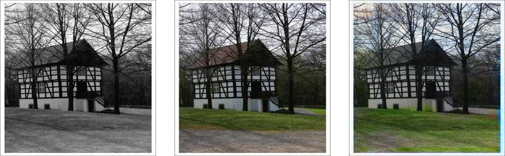
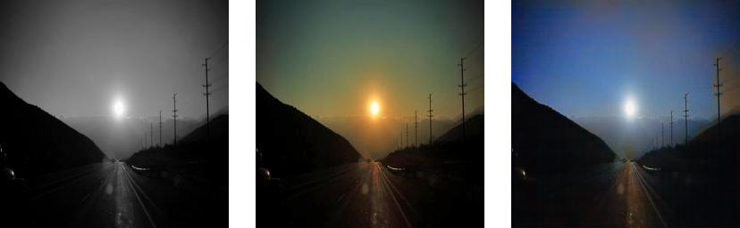
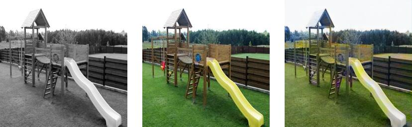
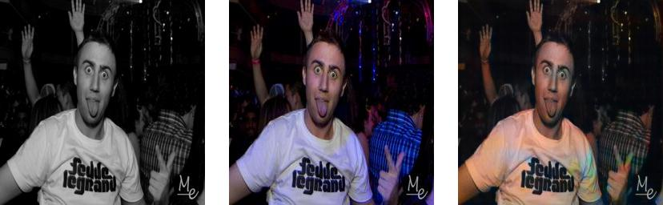

# Image-Colorization-using-Generative-Adversarial-Networks
```
 ██████╗ ██████╗ ██╗      ██████╗ ██████╗ ██╗███████╗███████╗
██╔════╝██╔═══██╗██║     ██╔═══██╗██╔══██╗██║╚══███╔╝██╔════╝
██║     ██║   ██║██║     ██║   ██║██████╔╝██║  ███╔╝ █████╗  
██║     ██║   ██║██║     ██║   ██║██╔══██╗██║ ███╔╝  ██╔══╝  
╚██████╗╚██████╔╝███████╗╚██████╔╝██║  ██║██║███████╗███████╗
 ╚═════╝ ╚═════╝ ╚══════╝ ╚═════╝ ╚═╝  ╚═╝╚═╝╚══════╝╚══════╝
```
This is implementation of the paper [《Image Colorization using Generative Adversarial Networks》](https://arxiv.org/pdf/1803.05400).

The process of automatic image colorization has been of significant interest for several application areas including restoration of aged or degraded images. This problem is highly ill-posed due to the large degrees of freedom during the assignment of color information. There have been many approaches using Deep Learning Models and Autoencoders but this was the first paper to use Generative Adversarial Networks.

The orginal model was trained on Cifar-10 dataset which contains 1.8 million images and on Places-365 dataset containing 50,000 images. Due to GPU Constraints, this model is trained on a subset of Places-365 dataset containing 5,000 images for 61 epochs. Some hyperparameters were manually changed during training to prevent overfitting. One thing observed during training was the model did well on images with sky, grasslands and sometime painted grasslands even when they weren't present in the original images. The main reason for this behaviour could be large number of images containing grasslands in training set. Having said that, the model achieved fairly good results given it was trained on a small dataset.

### Base-line Architecture.


You can download the Places-365 dataset [here](http://places2.csail.mit.edu/download.html).

Feel free to use my trained weights using [this](https://drive.google.com/file/d/13qcY4A3bv0yfdmkVvML9BRhaQNnj55g_/view?usp=sharing) drive link.

#### Some results of this model
-----------Gray Scale Images ------------------------- Original Image --------------------------- Predicted Image --------




